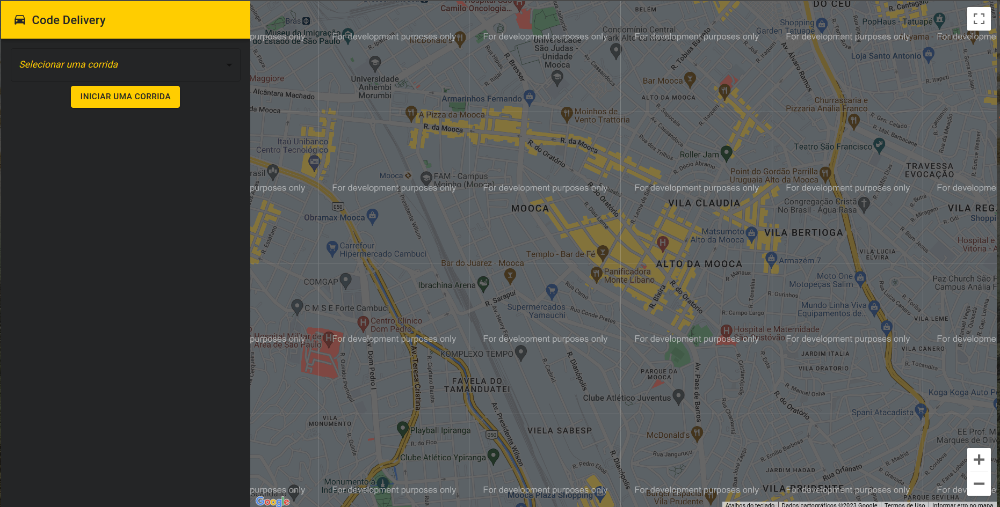

  <a href="#-tecnologias">Tecnologias</a>&nbsp;&nbsp;&nbsp;|&nbsp;&nbsp;&nbsp;
  <a href="#-projeto">Projeto</a>&nbsp;&nbsp;&nbsp;|&nbsp;&nbsp;&nbsp;
  <a href="#-como-rodar">Como rodar</a>&nbsp;&nbsp;&nbsp;|&nbsp;&nbsp;&nbsp;
  <a href="#-como-contribuir">Como contribuir</a>&nbsp;&nbsp;&nbsp;
  

 

## Full Cycle - React frontend

  

## 🚀 Tecnologias

Esse projeto foi desenvolvido com as seguintes tecnologias:

- [TypeScrip](typescriptlang.org)
- [Docker](https://www.docker.com/)
- [React](https://pt-br.reactjs.org/)

## 💻 Projeto

Fontend do projeto - Projeto não está funcionando.

[Simulador](https://github.com/jamangueira7/imersao-full-cycle-simulator-go)

[apache-kafka](https://github.com/jamangueira7/imersao-full-cycle-apache-kafka)

[backend](https://github.com/jamangueira7/imersao-full-cycle-api-nestjs)

## 🚀 Como Rodar

- Clone o projeto.
-  Entre na pasta do projeto e crie um arquivo .env na raiz do projeto com os valores que estão em .env.example
- Rode `docker-compose up -d`.

## 🤔 Como contribuir

- Faça um fork desse repositório;
- Cria uma branch com a sua feature: `git checkout -b minha-feature`;
- Faça commit das suas alterações: `git commit -m 'feat: Minha nova feature'`;
- Faça push para a sua branch: `git push origin minha-feature`.

Depois que o merge da sua pull request for feito, você pode deletar a sua branch.

## 📝 Licença

Esse projeto está sob a licença MIT.
